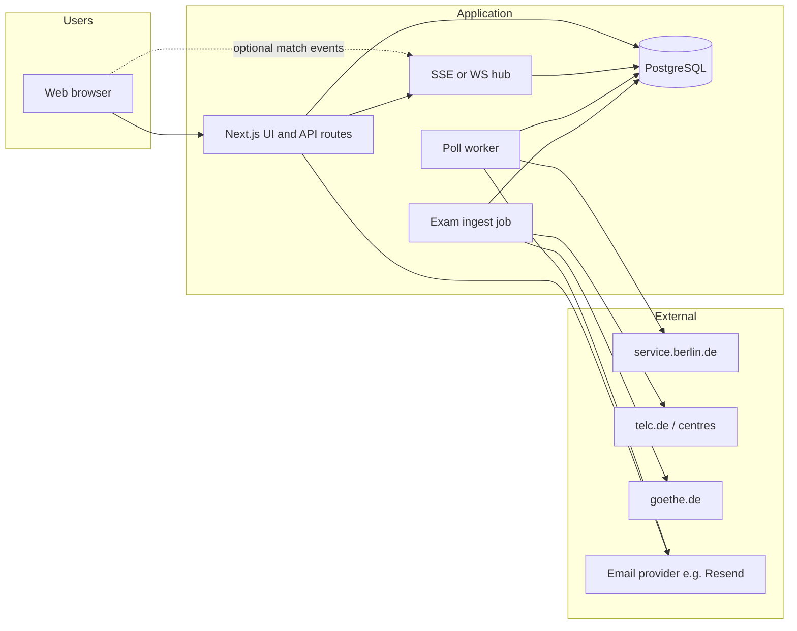

# Engineering specification: Berlin Relocation & Immigration Companion

**Version:** 0.2  
**Author:** Architect  
**Depends on:** `docs/prd.md` **v0.2**, `docs/rfc.md` (revision aligned with v0.2)  
**Date:** 2026-05-09

---

## 1. Architecture

### 1.1 Context (Mermaid)



### 1.2 Deployment (ASCII)

```
                    ┌─────────────┐
                    │   CDN /     │
                    │   Host      │
                    └──────┬──────┘
                           │
       ┌───────────────────┼───────────────────┐
       │                   │                   │
┌──────▼──────┐     ┌──────▼──────┐     ┌─────▼─────┐
│ Next.js app │     │ Poll worker │     │ Exam job  │
│ UI + API    │     │ Mon–Fri     │     │ (cron)    │
│ + SSE/WS    │     │ 07:00+      │     │ scrape    │
└──────┬──────┘     └──────┬──────┘     └─────┬─────┘
       │                   │                   │
       └───────────────────┴───────────────────┘
                           │
                    ┌──────▼──────┐
                    │ PostgreSQL  │
                    └─────────────┘
```

---

## 2. Component responsibilities

| Component | Responsibility |
|-----------|----------------|
| **Web (Next.js)** | **English-only** UI: journeys, explainer, watch wizard (email → location → Wunschtage + time bands → notification mode), exam directory from DB; REST API for watches; **SSE or WebSocket** (or short-poll fallback) for “page open” mode; legal footer and privacy (browser notifications called out). |
| **Poll worker** | **Only** during **Europe/Berlin Mon–Fri, ≥07:00**: **~60s** cadence per `service_target` (with backoff); fetch → normalize → **diff** → **match each active watch** by **weekday + morning/afternoon** → emit **email** and/or **real-time event**. |
| **Exam ingest job** | Periodic **scrape/parse** of **telc** and **Goethe** (and verified institution pages); upsert **`exam_listing`** rows; resolve **booking URL** best-effort; set `last_verified`. |
| **PostgreSQL** | Watches (with preferences + notification mode), snapshots, notification log, **exam listings**, optional match dedupe. |
| **Mail provider** | Confirmation, “slot available”, manage/cancel links. |
| **Realtime layer** | When watch has browser path: push **generic** “slot available” event to subscribed tabs (no PII in payload beyond watch id + link token). |

---

## 3. Data schemas

### 3.1 `service_target` (lookup table)

Configurable rows for each **pollable** Service Berlin **sub-location** (Einbürgerungstest standort).

| Column | Type | Notes |
|--------|------|--------|
| `id` | `uuid` | PK |
| `slug` | `text` | Stable key, e.g. `vhs-mitte-antonstrasse` |
| `label_en` | `text` | **Primary for MVP** (EN UI) — optional `label_de` if needed later |
| `service_berlin_url` | `text` | Full URL for booking flow for this standort |
| `active` | `boolean` | Disable without deploy |
| `created_at` | `timestamptz` | |

*Seed after URL discovery from [351180](https://service.berlin.de/dienstleistung/351180/).*

### 3.2 `watch`

| Column | Type | Notes |
|--------|------|--------|
| `id` | `uuid` | PK |
| `email` | `text` | For transactional mail (encrypt at rest if KMS available) |
| `email_hash` | `text` | Salted hash for dedupe / rate limits |
| `service_target_id` | `uuid` | FK — **one sub-location per watch** |
| `allowed_weekdays` | `smallint[]` or `bit` | **1–7 ISO or 0–6**: represent **Mon–Sat** per PRD (store set of allowed weekdays) |
| `allow_morning` | `boolean` | **07:00–13:00** local |
| `allow_afternoon` | `boolean` | **13:00–19:00** local |
| `notification_mode` | `enum` | `email_only` \| `browser_session` \| `browser_session_and_email` |
| `status` | `enum` | `pending_confirm`, `active`, `paused`, `cancelled` |
| `confirm_token_hash` | `text` | Until confirmed |
| `manage_token_hash` | `text` | Cancel/manage |
| `created_at` | `timestamptz` | |
| `last_notified_at` | `timestamptz` | Throttle repeats |
| `baseline_snapshot_id` | `uuid` | nullable; set on confirm so first diff does not notify for pre-existing slots |

**Validation:** at least one of `allow_morning`, `allow_afternoon` must be true; `allowed_weekdays` non-empty subset of PRD-allowed days (**Mon–Sat**).

### 3.3 `availability_snapshot`

| Column | Type | Notes |
|--------|------|--------|
| `id` | `uuid` | PK |
| `service_target_id` | `uuid` | FK |
| `content_hash` | `text` | Hash of **full** normalized slot list (change detection) |
| `normalized_json` | `jsonb` | See §3.5 |
| `captured_at` | `timestamptz` | |
| `raw_http_status` | `int` | |
| `fetch_error` | `text` | nullable |

### 3.4 `notification_log`

| Column | Type | Notes |
|--------|------|--------|
| `id` | `uuid` | PK |
| `watch_id` | `uuid` | FK |
| `snapshot_id` | `uuid` | FK |
| `channel` | `enum` | `email` \| `browser_push` (in-app/SSE event delivered) |
| `sent_at` | `timestamptz` | |
| `provider_message_id` | `text` | nullable (email) |

### 3.5 `normalized_json` shape (contract)

Parser must output **Berlin-local** instants for each slot:

```json
{
  "version": 1,
  "slots": [
    {
      "id": "string-stable-if-available",
      "start": "2026-06-01T09:00:00+02:00",
      "label": "optional"
    }
  ],
  "sourceFingerprint": "optional debug"
}
```

**Comparison rule:** `content_hash` = SHA-256 of canonical `slots` (sorted by `start`, then `id`).

**Matching rule (per watch):** slot **counts as new** if:

1. It was **not** in the **previous** snapshot’s slot set (by `id` or `start`), **or** product policy defines “material change” differently, **and**
2. **weekday** (in Europe/Berlin) ∈ `watch.allowed_weekdays`, **and**
3. **time** falls in **morning** and/or **afternoon** windows per booleans.

Implement **helper:** `slotMatchesWatch(slot, watch) -> boolean`.

**Saturday:** Include Saturday slots in normalized data whenever upstream returns them; user who selected Saturday gets matches even though **polling** only runs Mon–Fri.

### 3.6 `exam_listing` (scraped directory — MVP)

Replaces static-only `exam-directory.json`; optional JSON export for backup.

| Column | Type | Notes |
|--------|------|--------|
| `id` | `uuid` | PK |
| `slug` | `text` | Unique, e.g. `goethe-berlin-a1` |
| `name` | `text` | Institution display name (**EN** UI) |
| `area` | `text` | e.g. `Mitte`, `Neukölln` |
| `exam_system` | `enum` | `telc` \| `goethe` \| other |
| `levels` | `text[]` | e.g. `{A1,B1}` |
| `price_display` | `text` | As shown on site (e.g. €199) |
| `available_dates_display` | `text` | nullable; or `jsonb` if structured |
| `booking_url` | `text` | **Resolved** enrollment URL at scrape time (may expire) |
| `source_page_url` | `text` | Canonical page (e.g. [Goethe A1 Berlin](https://www.goethe.de/ins/de/en/prf/ort/ber/gza1.cfm)) |
| `last_verified` | `timestamptz` | |
| `active` | `boolean` | Soft-hide broken rows |

**Ingest:** job runs on a schedule (e.g. daily); logs parse errors; does not delete rows silently—mark `active=false` if 404.

---

## 4. API contracts

Base path: `/api`. JSON `application/json` unless noted.

### 4.1 `POST /api/watches`

**Purpose:** Create watch (`pending_confirm`).

**Request body:**

```json
{
  "email": "user@example.com",
  "serviceTargetId": "uuid",
  "allowedWeekdays": [1, 2, 3, 4, 5, 6],
  "allowMorning": true,
  "allowAfternoon": true,
  "notificationMode": "email_only",
  "consentPrivacy": true,
  "consentNotifications": true,
  "consentBrowserNotifications": false
}
```

| Field | Notes |
|-------|--------|
| `allowedWeekdays` | **Mon–Sat** encoding: document clearly (e.g. ISO **1=Mon … 6=Sat**; exclude Sunday) |
| `notificationMode` | `email_only` \| `browser_session` \| `browser_session_and_email` |
| `consentBrowserNotifications` | Must be true if mode includes browser path (client checks permission separately) |

**Responses:**

| Code | Body |
|------|------|
| `201` | `{ "watchId": "uuid", "status": "pending_confirm" }` |
| `400` | validation errors |
| `409` | duplicate policy if enforced |
| `429` | rate limited |

### 4.2 `GET /api/watches/confirm`

**Query:** `token=<signed token>` → `302` to `/watches/confirmed`.

### 4.3 `POST /api/watches/:id/cancel`

**Query/header:** manage token → `204` or `403`.

### 4.4 `GET /api/service-targets`

Returns all **active** `service_target` rows for location picker (`label_en`, `officialUrl`).

### 4.5 `GET /api/exam-directory`

Returns **`exam_listing`** rows from DB (`WHERE active = true`), sorted by `name`.

### 4.6 `GET /api/watches/:id/stream` (optional — SSE)

**Query:** `token=<short-lived watch session JWT>` for **browser_session** modes.

**Purpose:** **Server-Sent Events** stream: emit event `{ type: "slot_available", watchId, deepLink }` when worker fires a match for this watch.

**MVP alternative:** `GET /api/watches/:id/status` short-polling every **15s** while tab visible—simpler, slightly higher latency.

**Contract (SSE event payload):**

```json
{
  "type": "slot_available",
  "watchId": "uuid",
  "openUrl": "https://our-app/watches/action?..."
}
```

No passport numbers or authority PII.

### 4.7 `GET /api/health`

```json
{
  "ok": true,
  "db": "up",
  "workerLastRun": "2026-05-09T12:00:00Z",
  "pollWindowActive": true
}
```

`pollWindowActive`: `true` iff current time ∈ **Mon–Fri** & **≥07:00** Europe/Berlin (for debugging).

---

## 5. Worker behavior

### 5.1 Schedule & window

- Worker process runs continuously **or** wakes every **≤30s** to evaluate targets.
- For each `service_target`, poll **only if**:
  - **now** is **Monday–Friday** in **Europe/Berlin**, and
  - **local time ≥ 07:00**, and
  - `now >= next_poll_at[target]` (per-target clock).
- **Target interval:** `MIN_POLL_INTERVAL_SEC` default **60** (PRD v0.2). Increase dynamically on backoff (429/418/parse failure).
- **Outside window:** do not HTTP fetch; skip until next valid window.

### 5.2 Algorithm (per target)

1. If outside **§5.1 window**, skip (optionally set `next_poll_at` to next **07:00 Mon–Fri**).
2. Fetch upstream (timeout ~30s); parse → `normalized_json` → `content_hash`.
3. Compare to **latest** snapshot for target:
   - If hash **unchanged**, update `next_poll_at = now + interval`, done.
   - If **changed** (or first snapshot after baseline): compute **new slots** vs previous set (set diff by `id`/`start`).
4. For each **active** `watch` on this target:
   - Filter **new** slots with `slotMatchesWatch(slot, watch)`.
   - If non-empty:
     - **Email:** if `notification_mode` is `email_only` or `browser_session_and_email`, send email (respect `last_notified_at` throttle).
     - **Browser:** if `browser_session` or `browser_session_and_email`, publish to **SSE/WS** channel for `watch.id`.
     - Insert `notification_log` per channel fired.
5. Persist **new** snapshot row; advance `next_poll_at`.

### 5.3 User-Agent string

`BerlinImmigrationCompanion/1.0 (+https://<our-domain>/about-bot)` — legal final text.

---

## 6. Frontend routes (minimum)

| Path | Purpose |
|------|---------|
| `/` | Journey hub (**EN**) |
| `/registration`, `/permanent-residence`, `/citizenship` | Journey + checklist |
| `/einbuergerungstest` | Explainer + watch wizard: **email → VHS → weekdays + morning/afternoon → notification mode → confirm** |
| `/exams` | A1/B1 directory from **`exam_listing`** |
| `/privacy`, `/imprint` | Legal; privacy mentions **email + browser notifications** |
| `/watches/confirmed` | Post-confirm; if **browser_session**, prompt **Notification permission** and start SSE/poll |

---

## 7. Engineering task breakdown & acceptance criteria

### T1 — Repository scaffold

**Acceptance criteria:**

- [ ] `pnpm dev` serves app; **CI** lint; **English** default locale for UI framework if applicable.

### T2 — Content: journeys + checklists (EN)

**Acceptance criteria:**

- [ ] **P0-1–P0-3**, **English-only** visible copy.

### T3 — Legal chrome

**Acceptance criteria:**

- [ ] **P0-7**; disclosures for scraping and **non-official** site.

### T4 — Database schema & migrations

**Tasks:** Tables: `service_target`, `watch` (with **preferences + notification_mode**), `availability_snapshot`, `notification_log`, **`exam_listing`**.

**Acceptance criteria:**

- [ ] Migrations clean on empty DB; seed ≥1 target.

### T5 — Service Berlin targets discovery

**Acceptance criteria:**

- [ ] `GET /api/service-targets` returns **≥10** Berlin VHS sub-locations for Einbürgerungstest.

### T6 — Parser `AppointmentSource`

**Tasks:** Fetch may require POST parameters reflecting **Wunschtage** + time bands—**parameterize from watch** when polling per-target for shared snapshots:

- **Either** fetch **union** of all watches’ constraints on that target (complex), **or** fetch **broadest** calendar and **filter per watch** during match (RFC intent). Prefer **fetch once with permissive booking view** then **filter slots client-side per watch**—implementation must document chosen strategy.

**Acceptance criteria:**

- [ ] Fixtures + unit tests; **slotMatchesWatch** unit tests (**Mon–Sat**, morning/afternoon edges).

### T7 — Poll worker

**Acceptance criteria:**

- [ ] Fake clock: **no fetch** Sat/Sun or before **07:00** Berlin.
- [ ] **60s** default interval per target (config); backoff on simulated 429.
- [ ] On new matching slots for a watch, **email mock** and/or **event bus** invoked.

### T8 — Watch API + email + realtime stub

**Tasks:** `POST /api/watches` with full body; confirm/cancel; Resend (or similar); **implement SSE or short-poll** for browser mode.

**Acceptance criteria:**

- [ ] Double opt-in still recommended: inactive until confirm.
- [ ] **P0-5**: preferences + modes persisted; unsubscribe/cancel.

### T9 — Einbürgerungstest UX

**Acceptance criteria:**

- [ ] **P0-4** explainer; wizard matches PRD order (**email first**, then location, **Wunschtage** checkboxes, **morning/afternoon**, notification choice).

### T10 — Exam directory (scrape + UI)

**Tasks:** Ingest job for **Goethe** + **telc** URLs; upsert `exam_listing`; table UI with filters **A1/B1**.

**Acceptance criteria:**

- [ ] **P0-6**: ≥8 rows, `last_verified`, **booking** + **source** URLs; disclaimer on stale/session links.

### T11 — Observability

**Acceptance criteria:**

- [ ] Health shows **worker last run**; logs on parse failure; alert hook optional.

### T12 — Browser notifications (product)

**Tasks:** Request **Notification** permission after user selects **browser_session**\* modes; connect **SSE** (or poll) so toast / system notification fires on event.

**Acceptance criteria:**

- [ ] With permission, user receives **system notification** or in-app banner with link to book.

---

## 8. Risks & mitigations (engineering)

| Risk | Mitigation |
|------|------------|
| **1-minute polling** vs 403/418 | Backoff; singleton poller; legal review; adjustable `MIN_POLL_INTERVAL_SEC` |
| **Form POST** variance on Service Berlin | Integration tests; feature flags; manual fallbacks |
| **SSE scaling** | MVP single instance; sticky sessions if scaled |
| **Scrape drift** (Goethe/telc) | Fixtures; **`last_verified`**; disable row on repeated parse fail |
| **Session booking URLs expire** | Store **`source_page_url`**; “official booking page” link primary |
| GDPR | Data map; retention; minimal email in notifications |

---

## 9. Deviations / clarifications vs earlier v0.1 spec

- **Polling interval:** **60s** target inside active window (replaces **180s** as sole default).
- **Web Notifications / SSE:** **In MVP** for “page open” mode; not deferred to P1.
- **Exam data:** **Database + scraper**, not static JSON only.
- **English-only UI** enforced at content and API labels consumed by UI.

---

## 10. Definition of Done (MVP)

- [ ] **T1–T12** acceptance satisfied (or T12 scoped to SSE **or** short-poll + banner per sprint agreement).
- [ ] Smoke: confirm watch → simulated slot delta → **email** received; browser mode → **event** received in open tab.
- [ ] Privacy + imprint + browser notification disclosure live.
